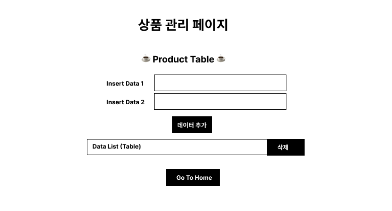

# Coffee Shop Management System
- 0608 - 기획 / 0613 ~ 0615, 0627~0629 개발
- <b> (데일리 프로젝트 확장) </b>

### 메인 UI

### 각 테이블 예시) 상품 관리 페이지

### 기능
> 테이블 관리
- 제품, 고객, 주문, 직원, 판매, 재고 테이블

### 코드
- [Python 파일](https://github.com/sr0020/Coffee_Shop/blob/main/database.py)
- [index.html (메인) 파일](https://github.com/sr0020/Coffee_Shop/tree/main/templates/index.html)
- [product.html (상품 관리 페이지) 파일](https://github.com/sr0020/Coffee_Shop/tree/main/templates/product.html)

### 기술스택
1. Python
2. Flask
3. MySQL
4. HTML/CSS