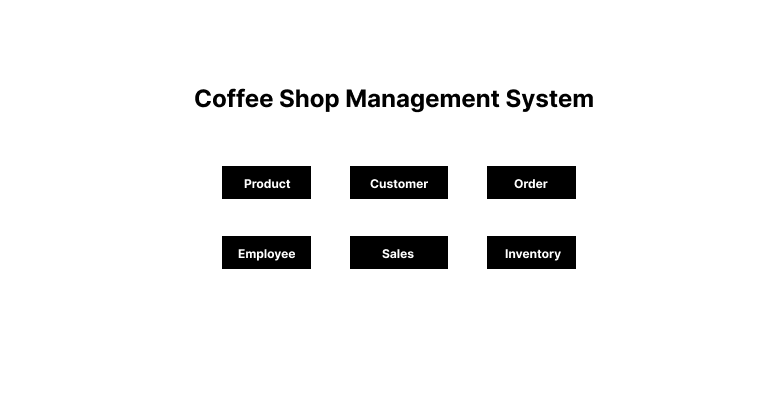

# Coffee Shop Database
- 0608 ~ 개발 중
- <b>데일리 프로젝트 확장 </b>

### UI

### 기능
> 테이블 관리
- 제품, 고객, 주문, 직원, 판매, 재고 테이블

### 코드 (<b>*** 링크 올리기</b>)
- [Python 파일](https://github.com/sr0020/Coffee_Shop/blob/main/database.py)
- [index.html (카페 데이터베이스 메인) 파일](https://github.com/sr0020/Coffee_Shop/tree/main/templates)

### 기술스택
1. Python
2. Flask
3. MySQL
4. HTML/CSS